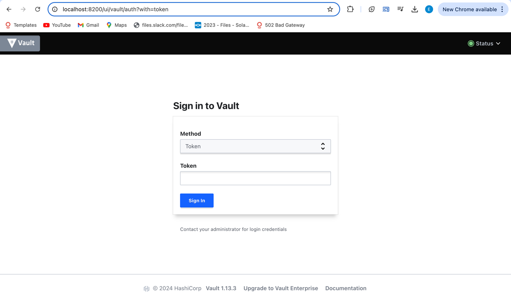
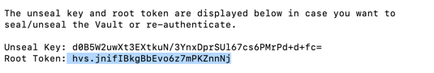
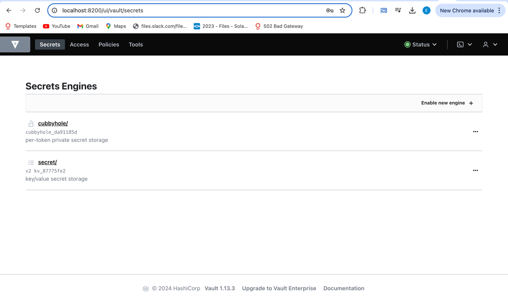
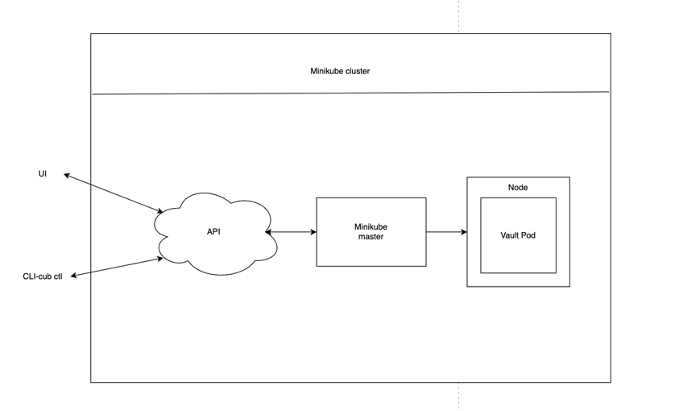
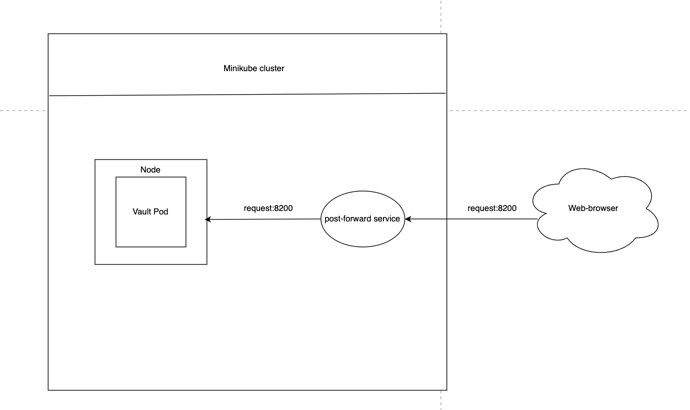

University: [ITMO University](https://itmo.ru/ru/) \
Faculty: [FICT](https://fict.itmo.ru) \
Course: [Introduction to distributed technologies](https://github.com/itmo-ict-faculty/introduction-to-distributed-technologies) \
Year: 2024/2025 \
Group: k4111c \
Author: Sagaydak Alina Alekseevna \
Lab: Lab1 \
Date of create: 10.11.2024 \
Date of finished: ...

## Лабораторная работа №1 "Установка Docker и Minikube, мой первый манифест."

### Описание
Это первая лабораторная работа в которой вы сможете протестировать Docker, установить Minikube и развернуть свой первый "под".

### Цель работы
Ознакомиться с инструментами Minikube и Docker, развернуть свой первый "под".

### Ход работы
1) Установить Docker;
2) Установить Minikube;
3) Развернуть minikube cluster;
4) Скачать образ HashiCorp Vault;
5) Написать manifest для развертывания пода с образом HashiCorp Vault;
6) Создать сервис для доступа к данному контейнеру;
7) Прокинуть порт для доступа к контейнеру;
8) Найти токен для доступа к vault
9) Войти, используя токен.

### Выполнение работы
#### 1. Установка Docker
Так как Docker у меня был установлен заранее, то его наличие подтверждаю следующей командой:
```bash
asagaydak@alinas-air lab1 % docker --version
Docker version 24.0.6, build ed223bc
```
#### 2. Установка Minikube
Аналогично и с Minikube:
```bash
asagaydak@alinas-air lab1 % minikube version
minikube version: v1.34.0
commit: 210b148df93a80eb872ecbeb7e35281b3c582c61
```
#### 3. Развертывание minikube cluster
При помощи команды minikube start можно запустить minikube cluster в рамках которого будут располагаться поды:
```bash
minikebe start
```
Результат выполнения команды представлен ниже:
```bash
asagaydak@alinas-air lab1 % minikube start
😄  minikube v1.34.0 on Darwin 13.5.2 (arm64)
✨  Using the docker driver based on existing profile
👍  Starting "minikube" primary control-plane node in "minikube" cluster
🚜  Pulling base image v0.0.45 ...
🔄  Restarting existing docker container for "minikube" ...
🐳  Preparing Kubernetes v1.31.0 on Docker 27.2.0 ...
🔎  Verifying Kubernetes components...
    ▪ Using image gcr.io/k8s-minikube/storage-provisioner:v5
🌟  Enabled addons: storage-provisioner, default-storageclass
🏄  Done! kubectl is now configured to use "minikube" cluster and "default" namespace by default
```
#### 4. Загрузка образа HashiCorp Vault
Для того, чтобы правильно описать под, необходимо предварительно скачать образ HashiCorp Vault с помощью команды docker pull vault:1.13.3 , где версия 1.13.3 Vault - это последняя актуальная версия:
```bash
docker pull vault:1.13.3
```
Результат выполнения команды представлен ниже:
```bash
asagaydak@alinas-air lab1 % docker pull vault:1.13.3
1.13.3: Pulling from library/vault
Digest: sha256:f98ac9dd97b0612746630033771bc7a8c86408a44a056f3f4be47fc576ec3744
Status: Image is up to date for vault:1.13.3
docker.io/library/vault:1.13.3

What's Next?
View a summary of image vulnerabilities and recommendations → docker scout quickview vault:1.13.3
После выполнения данной команды образ был успешно загружен
```

#### 5. Создание Manifest для развертывания пода с образом HashiCorp Vault
После того, как было определено какой образ какой версии нужно запустить и на каком порту, приступим к написанию manifest, описывающего сущность пода vault для кластера.

Для создания пода с образом HashiCorp Vault был создан файл-манифест [pods.yaml](pods.yaml), его содержимое представлено ниже:
```yaml
apiVersion: v1
kind: Pod
metadata:
  name: vault
  labels:
    name: vault
spec:
  containers:
    - name: vault
      image: vault:1.13.3
      ports:
        - containerPort: 8200
```
здесь apiVersion - это версия api

kind - абстракция, которую мы запускаем (например, под)

metadata.name - имя пода, который запускаем (например, есть 3 пода с разными именами, внутри которых запущено одно и то же приложение)

metadata.labels.name - метка, по которой можно обратиться к любому из этих 3х подов или что-то с ними сделать

spec - описание каким должно быть приложение

containers - нужно запускать контейнеры в рамках этого пода

name - название изображения

image - название докер изображения с указанием версии

ports - порт на котором будет запущено изображение

#### 6. Создание сервиса для доступа к данному контейнеру
Применяем манифест пода vault в нашем кластере, тем самым создается под:
```bash
minikube kubectl -- apply -f pods.yaml
```

Результат ее выполнения представлен ниже:
```bash
asagaydak@alinas-air lab1 % minikube kubectl -- apply -f pods.yaml
pod/vault created
```
Данная команда создает сервис для пода vault. Сервис будет перенаправлять трафик на под vault через порт 8200.
```bash
minikube kubectl -- expose pod vault --type=NodePort --port=8200
```
 Результат выполнения команды представлен ниже:
```bash
asagaydak@alinas-air lab1 % minikube kubectl -- expose pod vault --type=NodePort --port=8200

service/vault exposed
```
#### 7. Прокидывание порта для доступа к контейнеру
Для того, чтобы кластер мог получать запросы извне (например, с порта localhost:8200), мы должны перенаправить эти запросы на порт в рамках minikube cluster.

Таким образом, устанавливаем соединение между портом 8200 на локальной машине и портом 8200 сервиса vault, который работает внутри кластера:
```bash
minikube kubectl -- port-forward service/vault 8200:8200
```
Результат выполнения команды представлен ниже:
```bash
asagaydak@alinas-air lab1 % minikube kubectl -- port-forward service/vault 8200:8200
Forwarding from 127.0.0.1:8200 -> 8200
Forwarding from [::1]:8200 -> 8200
```
При переходе по адресу `localhost:8200`, получим доступ к сервису Vault:


#### 8. Поиск токена для доступа к vault
С помощью команды, указанной ниже, мы можем посмотреть логи пода и в них найти токен для входа в vault:
```bash
minikube kubectl logs vault
```
В результате получаем логи, в которых содержится токен:

#### 9. Осуществление входа при помощи найденного токена
Далее при помощи полученного токена был успешно осуществлен вход:


### Диаграмма организации
Схема организации кластера (например, применение манифеста должно пройти по такому пути - либо через ui (OpenLens), либо через cub ctl как указано в лабораторной работе) для создания пода:



Схема прохождения запроса к поду:


