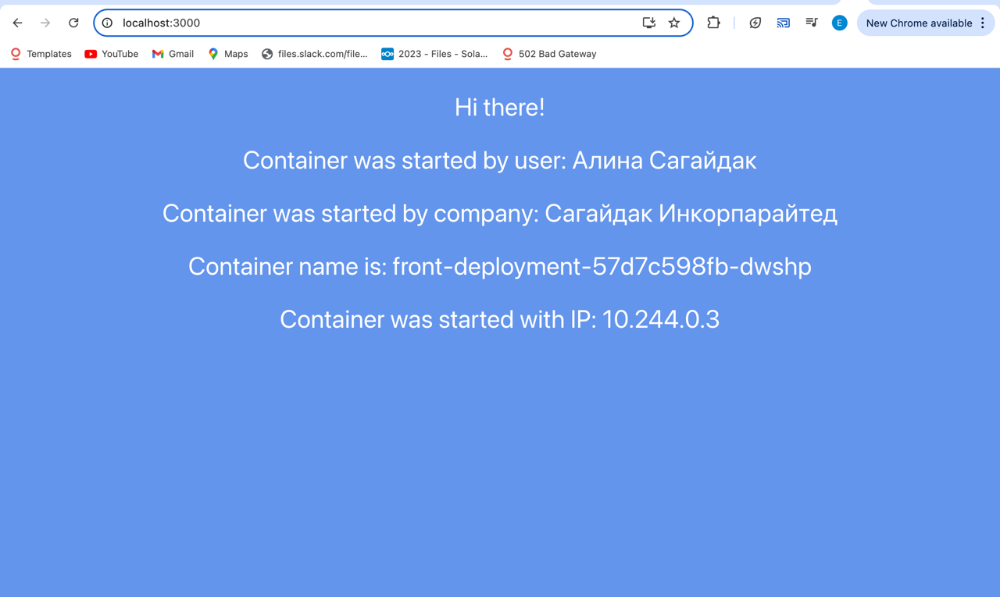
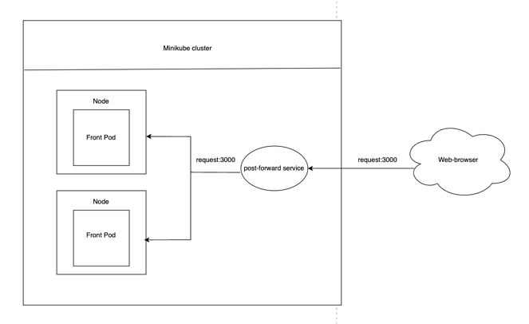

University: [ITMO University](https://itmo.ru/ru/) \
Faculty: [FICT](https://fict.itmo.ru) \
Course: [Introduction to distributed technologies](https://github.com/itmo-ict-faculty/introduction-to-distributed-technologies) \
Year: 2024/2025 \
Group: k4111c \
Author: Sagaydak Alina Alekseevna \
Lab: Lab1 \
Date of create: 10.11.2024 \
Date of finished: ...
## Лабораторная работа №2 "Развертывание веб сервиса в Minikube, доступ к веб интерфейсу сервиса. Мониторинг сервиса."

### Цель работы

Ознакомиться с типами "контроллеров" развертывания контейнеров, ознакомится с сетевыми сервисами и развернуть свое веб приложение.

### Ход работы

1) Создать `deployment` с 2 репликами контейнера [ifilyaninitmo/itdt-contained-frontend:master](https://hub.docker.com/repository/docker/ifilyaninitmo/itdt-contained-frontend) и передать переменные в эти реплики: `REACT_APP_USERNAME`, `REACT_APP_COMPANY_NAME`.
2) Создать сервис через который будет доступ на эти "поды". Выбор типа сервиса остается на ваше усмотрение.
3) Запустить в `minikube` режим проброса портов и подключиться к контейнерам через веб браузер.
4) Проверить на странице в веб-браузере переменные `REACT_APP_USERNAME`, `REACT_APP_COMPANY_NAME` и `Container name`. Изменяются ли они? Если да то почему?
5) Проверить логи контейнеров, приложите логи в отчёт.
6) Схема организации контейеров и сервисов нарисованная вами в draw.io или Visio.

### Выполнение работы
#### 1. Создание Deployment
Для начала необходимо описать manifest деплоймента.

Поменялся kind - абстракция сущности `Deployment`, добавились поля, отвечающие за количество подов `replicas`, а также за переменные запуска `env`.

Для создания деплоймента был создан файл-манифест [deployment.yaml](deployment.yaml), его содержимое представлено ниже:
```yaml
apiVersion: apps/v1
kind: Deployment
metadata:
  name: front-deployment
  labels:
    app: front
spec:
  replicas: 2
  selector:
    matchLabels:
      app: front
  template:
    metadata:
      labels:
        app: front
    spec:
      containers:
        - name: frontend
          image: ifilyaninitmo/itdt-contained-frontend:master
          env:
            - name: REACT_APP_USERNAME
              value: "Алина Сагайдак"
            - name: REACT_APP_COMPANY_NAME
              value: "Сагайдак Инкорпарайтед"
          ports:
            - containerPort: 3000
```
Cоздаем объект Deployment при помощи команды:

```bash
asagaydak@alinas-air lab2 % minikube kubectl -- apply -f deployment.yaml
deployment.apps/vault-deployment created
```
и проверяем созданные поды и деплоймент:
```bash
asagaydak@alinas-air lab2 % minikubectl get pods
zsh: command not found: minikubectl
asagaydak@alinas-air lab2 % minikube kubectl get pods
NAME                                READY   STATUS    RESTARTS   AGE
front-deployment-57d7c598fb-dwshp   1/1     Running   0          95s
front-deployment-57d7c598fb-svz7p   1/1     Running   0          95s
asagaydak@alinas-air lab2 % minikube kubectl get deployments
NAME               READY   UP-TO-DATE   AVAILABLE   AGE
front-deployment   2/2     2            2           101s
```

#### 2. Создание сервиса
Cоздаем сервис при помощи команды:
```bash
asagaydak@alinas-air lab2 % minikube kubectl -- expose deployment vault-deployment --port=8200 --name=vault-service --type=ClusterIP
service/vault-service exposed
```
Тип сервиса указан `ClusterIP`, данный тип означает, что сервис будет доступен только внутри самого кластера.

#### 3. Проброс портов
Для того, чтобы кластер мог получать запросы извне (например, с порта localhost:3000), мы должны перенаправить эти запросы на порт в рамках minikube cluster:
```bash
asagaydak@alinas-air lab2 % minikube kubectl -- port-forward service/vault-service 3000:3000
Forwarding from 127.0.0.1:3000 -> 3000
Forwarding from [::1]:3000 -> 3000
Handling connection for 3000
Handling connection for 3000
Handling connection for 3000
Handling connection for 3000
```
#### 4. Проверка в браузере
При переходе по адресу `localhost:3000`, получим доступ к следующей странице:


Как видим переменные `REACT_APP_USERNAME` и `REACT_APP_COMPANY_NAME` не изменились, так как эти переменные окружения заданы в манифесте при создании объекта `Deployment`. А переменная `Container name` изменяется в зависимости от того, какой под обрабатывает запрос.
#### 5. Проверка логов контейнера

Логи подов представлены ниже:
```bash
asagaydak@alinas-air lab2 % minikube kubectl logs vault-deployment-7687b7f945-b29tx
Builing frontend
Browserslist: caniuse-lite is outdated. Please run:
npx update-browserslist-db@latest
Why you should do it regularly: https://github.com/browserslist/update-db#readme
Browserslist: caniuse-lite is outdated. Please run:
npx update-browserslist-db@latest
Why you should do it regularly: https://github.com/browserslist/update-db#readme
build finished
Server started on port 3000
asagaydak@alinas-air lab2 % minikube kubectl logs vault-deployment-7687b7f945-x827d
Builing frontend
Browserslist: caniuse-lite is outdated. Please run:
npx update-browserslist-db@latest
Why you should do it regularly: https://github.com/browserslist/update-db#readme
Browserslist: caniuse-lite is outdated. Please run:
npx update-browserslist-db@latest
Why you should do it regularly: https://github.com/browserslist/update-db#readme
build finished
Server started on port 3000
```
### Диаграмма организации
Схема прохождения запроса к подам:
