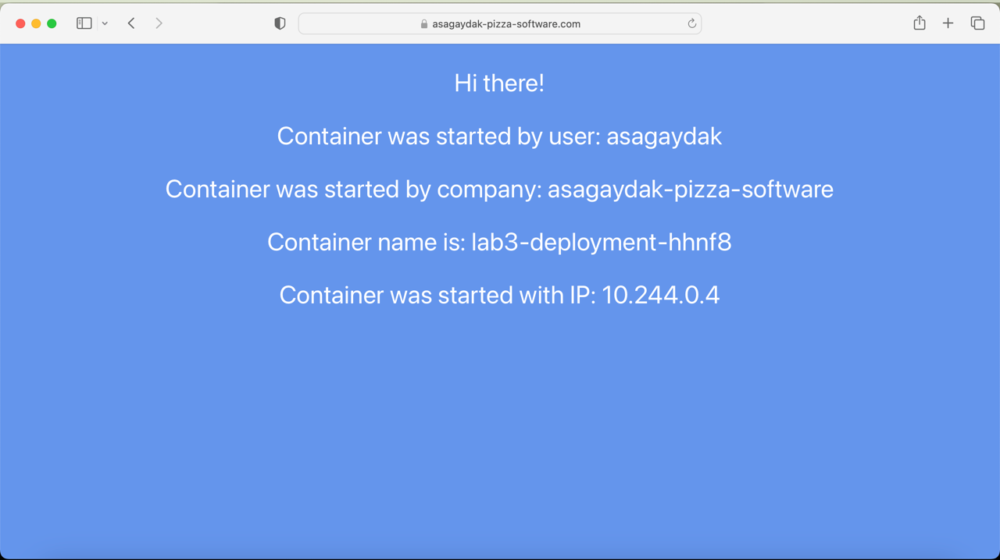
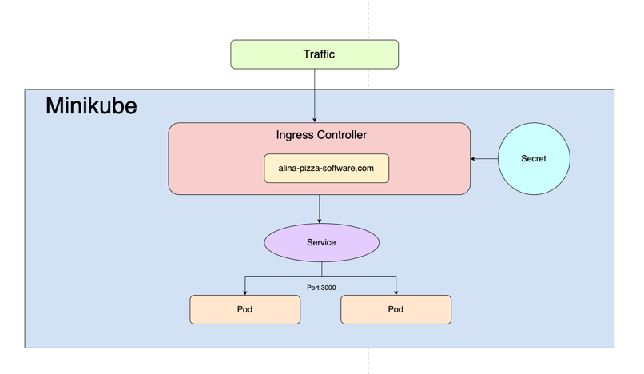

University: [ITMO University](https://itmo.ru/ru/) \
Faculty: [FICT](https://fict.itmo.ru) \
Course: [Introduction to distributed technologies](https://github.com/itmo-ict-faculty/introduction-to-distributed-technologies) \
Year: 2024/2025 \
Group: k4111c \
Author: Sagaydak Alina Alekseevna \
Lab: Lab3 \
Date of create: 26.11.2024 \
Date of finished: ...
## Лабораторная работа №3 "Сертификаты и "секреты" в Minikube, безопасное хранение данных."

### Цель работы

Познакомиться с сертификатами и "секретами" в Minikube, правилами безопасного хранения данных в Minikube.

### Ход работы

1) Создать ConfigMap с переменными среды REACT_APP_USERNAME и REACT_APP_COMPANY_NAME; 
2) Создать ReplicaSet с 2 репликами контейнера ifilyaninitmo/itdt-contained-frontend:master; 
3) Включить Ingress и создать TLS-сертификат; 
4) Создать Ingress, который будет использовать сервис и секрет с TLS-сертификатом; 
5) Настроить HOSTS; 
6) Открыть minikube tunnel;
7) Проверка результатов.

### Выполнение работы
#### 1. Создание ConfigMap
Для начала необходимо описать конфигурационный файл ConfigMap.

Для создания ConfigMap был создан файл-манифест [configmap.yaml](configmap.yaml), его содержимое представлено ниже:
```yaml
apiVersion: v1
kind: ConfigMap
metadata:
  name: lab3-configmap
data:
  REACT_APP_USERNAME: "asagaydak"
  REACT_APP_COMPANY_NAME: "asagaydak-pizza-software"
```
Cоздаем объект ConfigMap при помощи команды:

```bash
asagaydak@alinas-air lab3 % minikube kubectl -- apply -f configmap.yaml
configmap/lab3-configmap created
```
#### 2. Создание ReplicaSet
ReplicaSet — это объект в Kubernetes, который обеспечивает поддержание заданного количества идентичных копий подов в кластере. 
Это позволяет достичь высокой доступности и устойчивости приложения. ReplicaSet следит за состоянием подов и автоматически создает или удаляет их в зависимости от текущего состояния, чтобы поддерживать требуемое количество копий.

Для начала необходимо описать manifest ReplicaSet [deployment.yaml](deployment.yaml).
```yaml
apiVersion: apps/v1
kind: ReplicaSet
metadata:
  name: lab3-deployment
spec:
  replicas: 2
  selector:
    matchLabels:
      app: lab3-deployment
  template:
    metadata:
      labels:
        app: lab3-deployment
    spec:
      containers:
        - name: frontend
          image: ifilyaninitmo/itdt-contained-frontend:master
          ports:
            - containerPort: 3000
          envFrom:
            - configMapRef:
                name: lab3-configmap
```
Cоздаем объект ReplicaSet при помощи команды:

```bash
asagaydak@alinas-air lab3 % minikube kubectl -- apply -f deployment.yaml
replicaset.apps/lab3-deployment created
```
#### 3. Включение Ingress и создание TLS-сертификата
Ingress - это объект Kubernetes, который управляет внешним доступом к сервисам внутри кластера. Он позволяет направлять HTTP(S)-запросы к нужным сервисам на основе правил, например, URL или хост-направления.
У него есть 3 основные функции:
- Маршрутизация трафика. Позволяет определить, какие запросы должны быть направлены к каким сервисам на основе доменов или путей;
- Обработка SSL/TLS. Поддерживает безопасное соединение при помощи сертификатов, что позволяет шифровать трафик;
- Балансировка нагрузки. Распределяет входящий трафик между репликами приложения.
Для включения Ingress была выполнена следующая команда:

Теперь включим Ingress с помощью команды:
```bash
asagaydak@alinas-air lab3 % minikube addons enable ingress
💡  ingress is an addon maintained by Kubernetes. For any concerns contact minikube on GitHub.
You can view the list of minikube maintainers at: https://github.com/kubernetes/minikube/blob/master/OWNERS
💡  After the addon is enabled, please run "minikube tunnel" and your ingress resources would be available at "127.0.0.1"
    ▪ Using image registry.k8s.io/ingress-nginx/kube-webhook-certgen:v1.4.3
    ▪ Using image registry.k8s.io/ingress-nginx/controller:v1.11.2
    ▪ Using image registry.k8s.io/ingress-nginx/kube-webhook-certgen:v1.4.3
🔎  Verifying ingress addon...
🌟  The 'ingress' addon is enabled
```
Далее создадим TLS-сертификат. 
```bash
asagaydak@alinas-air lab3 % openssl req -new -newkey rsa:4096 -x509 -sha256 -days 365 -nodes -out MyCertificate.crt -keyout MyKey.key -subj "/CN=asagaydak-pizza-software.com"
.....+.....+.......+.........+.....................+.........+..+.........+...+.......+...+..+.+...+..+..........+..+++++++++++++++++++++++++++++++++++++++++++++*..+.+..............+.+...+...+.........+........+.+...........+.+..+...+.......+...+...+..+...............+.......+..+...+.+++++++++++++++++++++++++++++++++++++++++++++*.........+.......+...............+............+...............+...............+....................+......+....+...+..................+..+.......+..+...+............+......+............+.+...........+...+.......+++++
............+....+......+......+............+.....................+..+..........+..+.+.........+..+...+.......+...+...........+.+...+............+......+...+..+....+.....+...+..........+..+++++++++++++++++++++++++++++++++++++++++++++*.............+.........+..+++++++++++++++++++++++++++++++++++++++++++++*...+.+.........+......+...............+..+................+..+.......+..+.+...+.........+.....+.+.....+...................+...+...+.....................+.....+.+..+.......+...+......+...........+.+..+...+....+...+.....+.......+...........+....+......+...+..........................+.........+.....................+..........+........+.+....................+.+.....+....+......+.....+.+..+...+............+...+..........+...............+............+..+......+.......+...+............+...+..+.............+..+...............+...+....+......+...+..+............+.+...........+......+............+......+.+...+...+...+.....+......+.+............+..+.+.....+.........................+..+.......+...+...........+.......+.....+.........+.+...+.....+......+..........+.....+...............+......+...+....+........+............+.+.....+..............................+......+.+........+....+..+..........+.....+..................+.+.........+.....+...+...+.......+..+.+..+...................+..............+...............+.+...+.................+...+..........+..+...+..........+...+.....+..........+.........+.....+....+......+...+.....+......+....+..+......+...+................+........+.......+......+.....+..........+..............+....+.........+...........+.+..............+......+...+.+..+....+.....+......+.............+..+............+............+.............+................................+....+.................+..........+..............+.+..+......+.+......+.........+...+...........+....+........+............+...+..................+.+......+..+.......+..............+.+.....+......+....+........+...........................+.+....................+............+......+........................+...+....+.....+.+.....+.......+........+.......+.....+.+...........+....+.....+.........+......+................+........+......+......+...+...+....+..................+........+....+.....+....+.....+............+...+....+......+............+...+..+....+.....+......+.............+..+.......+...............+..+................+.....+....+......+........+..........+.....+.+...+...+.....+.......+..+.+........+.......+..+.......+...........+...+...............+......+.+..............+..................+......+......................+.........+.....+....+...............+.....+......................+..+.+..+....+..................+..+.............+......+.........+......+....................+.......+..............+....+......+...+..+...+......+....+........+..........+..+...+.......+......+..+...+.......+.........+...+..+.+..............+.........+.......+..................+...........+...............+...+..........+.....+.+.....+....+..................+..+...............+.............+..................+..+.........................+...+...........+....+.....+.........+...+...............+..................+....+..+++++
```
Получился самоподписанный сертификат MyCertificate.crt и соответствующий ему закрытый ключ MyKey.key, привязанный к домену asagaydak-pizza-software.com.

Теперь импортируем сертификат в minikube, как объект secret, с помощью команды:
```bash
asagaydak@alinas-air lab3 % minikube kubectl -- create secret tls app-tls --key MyKey.key --cert MyCertificate.crt
secret/app-tls created
```

#### 4. Создание Ingress
Далее создадим объект Ingress, который будет использовать сервис приложения и секрет с TLS-сертификатом.

Для начала необходимо описать конфигурацию данного объекта [ingress.yaml](ingress.yaml).
```yaml
apiVersion: networking.k8s.io/v1
kind: Ingress
metadata:
  name: lab3-ingress
spec:
  tls:
    - hosts:
        - asagaydak-pizza-software.com
      secretName: app-tls
  rules:
    - host: asagaydak-pizza-software.com
      http:
        paths:
          - path: /
            pathType: Prefix
            backend:
              service:
                name: lab3-service
                port:
                  number: 3000
```
Теперь создаем сервис при помощи команды:
```bash
asagaydak@alinas-air lab3 % minikube kubectl -- expose replicaset lab3-deployment --port=3000 --name=lab3-service --type=ClusterIP
service/lab3-service exposed
```
Тип сервиса указан `ClusterIP`, данный тип означает, что сервис будет доступен только внутри самого кластера.

Теперь можно смело создать объект Ingress при помощи команды:
```bash
asagaydak@alinas-air lab3 % minikube kubectl -- apply -f ingress.yaml
ingress.networking.k8s.io/lab3-ingress created
```

#### 5. Настройка HOSTS
Для того, чтобы настроить hosts, необходимо узнать IP-адрес, на котором работает minikube:
```bash
asagaydak@alinas-air lab3 % minikube ip
192.168.49.2
```
Теперь добавим конфигурацию в файл /etc/hosts:
```bash
127.0.0.1       localhost
192.168.49.2    asagaydak-pizza-software
```
#### 6. Открыть minikube tunnel
Воспользуемся командой `minikube tunnel`, которая позволит получить доступ к сервисам внутри Minikube. 

Это упрощает взаимодействие с сервисами, размещенными в кластере Minikube, предоставляя внешние IP-адреса для них.
```bash
asagaydak@alinas-air lab3 % minikube tunnel
✅  Tunnel successfully started

📌  NOTE: Please do not close this terminal as this process must stay alive for the tunnel to be accessible ...

❗  The service/ingress lab3-ingress requires privileged ports to be exposed: [80 443]
🔑  sudo permission will be asked for it.
🏃  Starting tunnel for service lab3-ingress.
Password:
```
#### 7. Проверка результатов
При переходе по адресу `asagaydak-pizza-software` отображется следующая страница:



#### Диаграмма организации

