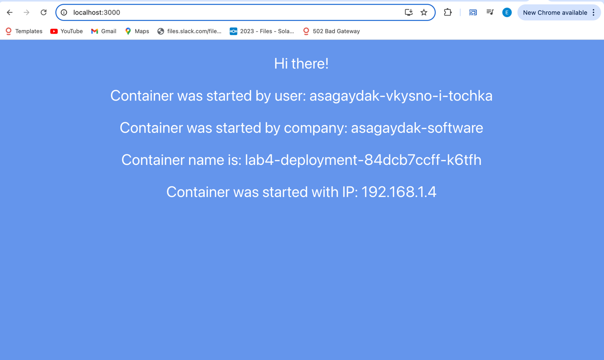
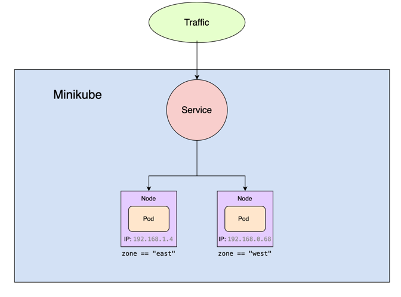

University: [ITMO University](https://itmo.ru/ru/) \
Faculty: [FICT](https://fict.itmo.ru) \
Course: [Introduction to distributed technologies](https://github.com/itmo-ict-faculty/introduction-to-distributed-technologies) \
Year: 2024/2025 \
Group: k4111c \
Author: Sagaydak Alina Alekseevna \
Lab: Lab4 \
Date of create: 04.12.2024 \
Date of finished: ...
## Лабораторная работа №4 "Сети связи в Minikube, CNI и CoreDNS."

### Цель работы

Познакомиться с CNI Calico и функцией IPAM Plugin, изучить особенности работы CNI и CoreDNS.

### Ход работы

1) Запустить minikube вместе с плагином Calico;
2) Проверить работу CNI плагина Calico и количество нод; 
3) Для запущеных ранее нод указать label по признаку стойки или географического расположения; 
4) На основе ранее указанных меток назначить IP адреса подам; 
5) Cоздать deployment с 2 репликами контейнера ifilyaninitmo/itdt-contained-frontend:master и передать переменные в эти реплики: REACT_APP_USERNAME, REACT_APP_COMPANY_NAME; 
6) Создать сервис через который будет доступ на эти поды; 
7) Запустить в minikube режим проброса портов и подключиться к контейнерам через веб-браузер; 
8) Используя kubectl exec зайти в любой под и попробовать попинговать поды используя FQDN имя соседенего пода, результаты пингов необходимо приложить к отчету.

### Выполнение работы
#### 0. Установим Calico
Calico - это сетевой плагин для Kubernetes, который обеспечивает сетевую политику и сетевую безопасность для контейнеризированных приложений. 
У него есть следующие функциональные возможности:
1) Поддержка сетевых политик;
2) IP-адресация;
3) Интеграция с другими сервисами для организации сетевого взаимодействия.

#### 1. Запуск minikube
Запустим minikube с помощью следующей команды:

```bash
asagaydak@alinas-air ~ % minikube start --network-plugin=cni --cni=calico --nodes=2
😄  minikube v1.34.0 on Darwin 13.5.2 (arm64)
✨  Automatically selected the docker driver
❗  With --network-plugin=cni, you will need to provide your own CNI. See --cni flag as a user-friendly alternative
📌  Using Docker Desktop driver with root privileges
👍  Starting "minikube" primary control-plane node in "minikube" cluster
🚜  Pulling base image v0.0.45 ...
🔥  Creating docker container (CPUs=2, Memory=2200MB) ...
🐳  Preparing Kubernetes v1.31.0 on Docker 27.2.0 ...
    ▪ Generating certificates and keys ...
    ▪ Booting up control plane ...
    ▪ Configuring RBAC rules ...
🔗  Configuring Calico (Container Networking Interface) ...
🔎  Verifying Kubernetes components...
    ▪ Using image gcr.io/k8s-minikube/storage-provisioner:v5
🌟  Enabled addons: storage-provisioner, default-storageclass

👍  Starting "minikube-m02" worker node in "minikube" cluster
🚜  Pulling base image v0.0.45 ...
🔥  Creating docker container (CPUs=2, Memory=2200MB) ...
🌐  Found network options:
    ▪ NO_PROXY=192.168.49.2
🐳  Preparing Kubernetes v1.31.0 on Docker 27.2.0 ...
    ▪ env NO_PROXY=192.168.49.2
🔎  Verifying Kubernetes components...
🏄  Done! kubectl is now configured to use "minikube" cluster and "default" namespace by default
```
Говорим, что minikube должен использовать стандарт CNI (Container Network Interface) для управления сетями в кластере Kubernetes, в качестве сетевого плагина CNI используется calico, также указывается, что создаются две рабочие ноды.

Стандарт CNI (Container Network Interface) — это спецификация, предназначенная для управления сетевыми интерфейсами в контейнеризованных средах - например, Kubernetes. 
CNI определяет набор API и протоколов, которые позволяют контейнерам устанавливать и управлять сетевыми соединениями.

#### 2. Проверка работы
Введем команды для того, чтобы убедиться, что поды и ноды были успешно развернуты:
```bash
asagaydak@alinas-air ~ % minikube kubectl -- get nodes
NAME           STATUS   ROLES           AGE   VERSION
minikube       Ready    control-plane   89s   v1.31.0
minikube-m02   Ready    <none>          75s   v1.31.0
asagaydak@alinas-air ~ % minikube kubectl -- get pods -l k8s-app=calico-node -A
NAMESPACE     NAME                READY   STATUS    RESTARTS   AGE
kube-system   calico-node-kdvn5   1/1     Running   0          2m4s
kube-system   calico-node-mxftx   1/1     Running   0          118s
```
#### 3. Маркировка нод
Зададим нодам метки (label) на основании их расположения:
```bash
asagaydak@alinas-air ~ % minikube kubectl -- label nodes minikube zone=west                      
node/minikube labeled
asagaydak@alinas-air ~ % minikube kubectl -- label nodes minikube-m02 zone=east
node/minikube-m02 labeled
```
#### 4. Назначение IP адресов подам
Удалим дефолтные IP-пулы, которые были автоматически заданы:
```bash
asagaydak@alinas-air ~ % minikube kubectl -- delete ippools default-ipv4-ippool
ippool.crd.projectcalico.org "default-ipv4-ippool" deleted
```
Теперь создадим конфигурационные файлы `ippool_east` и `ippool_west`, в которых описывается пул IP-адресов для соотвествующих узлов с метками `zone=east` и `zone=west`. 

Конфигурационный файл [ippool_east.yaml](ippool_east.yaml)
```yaml
apiVersion: projectcalico.org/v3
kind: IPPool
metadata:
  name: zone-east-ippool
spec:
  cidr: 192.168.1.0/24
  ipipMode: Always
  natOutgoing: true
  nodeSelector: zone == "east"
```
Конфигурационный файл [ippool_west.yaml](ippool_west.yaml)
```yaml
apiVersion: projectcalico.org/v3
kind: IPPool
metadata:
  name: zone-west-ippool
spec:
  cidr: 192.168.0.0/24
  ipipMode: Always
  natOutgoing: true
  nodeSelector: zone == "west"
```
Далее с помощью команды calicoctl create создаются новые объекты (IP-пулы) в Calico на основании описания в YAML-файлах.
```bash
asagaydak@alinas-air lab4 % calicoctl create -f ippool_west.yaml --allow-version-mismatch
Successfully created 1 'IPPool' resource(s)
asagaydak@alinas-air lab4 % calicoctl create -f ippool_east.yaml --allow-version-mismatch
Successfully created 1 'IPPool' resource(s)
```
Теперь проверим, что IP-пулы создались:
```bash
asagaydak@alinas-air lab4 % calicoctl get  ippool -o wide --allow-version-mismatch       
NAME               CIDR             NAT    IPIPMODE   VXLANMODE   DISABLED   DISABLEBGPEXPORT   SELECTOR         
zone-east-ippool   192.168.1.0/24   true   Always     Never       false      false              zone == "east"   
zone-west-ippool   192.168.0.0/24   true   Always     Never       false      false              zone == "west"  
```

#### 5. Создание Deployment
Создадим конфигурационный файл [deployment.yaml](deployment.yaml), в нем задается тип объекта kind, 
его идентификатор name, количество реплик replicas, а также спецификация контейнеров, которая включается в себя образ image, 
имя контейнера name, и переменные окружения env - `REACT_APP_USERNAME` и `REACT_APP_COMPANY_NAME`.

```yaml
apiVersion: apps/v1
kind: Deployment
metadata:
  name: lab4-deployment
spec:
  replicas: 2
  selector:
    matchLabels:
      app: lab4-deployment
  template:
    metadata:
      labels:
        app: lab4-deployment
    spec:
      containers:
        - name: frontend
          image: ifilyaninitmo/itdt-contained-frontend:master
          ports:
            - containerPort: 3000
          env:
            - name: REACT_APP_USERNAME
              value: "asagaydak-vkysno-i-tochka"
            - name: REACT_APP_COMPANY_NAME
              value: "asagaydak-software"
```
Cоздаем объект Deployment при помощи команды:
```bash
asagaydak@alinas-air lab4 % minikube kubectl -- apply -f deployment.yaml
deployment.apps/lab4-deployment created
```
#### 6. Cоздание сервиса
Создадим сервис:
```bash
asagaydak@alinas-air lab4 % minikube kubectl -- expose deployment lab4-deployment --port=3000 --name=lab4-service --type=ClusterIP
service/lab4-service exposed
```
Тип сервиса указан `ClusterIP`, данный тип означает, что сервис будет доступен только внутри самого кластера.

#### 7. Проброс портов
Пробросим порты с помощью команды:
```bash
asagaydak@alinas-air lab4 % minikube kubectl -- port-forward service/lab4-service 3000:3000
Forwarding from 127.0.0.1:3000 -> 3000
Forwarding from [::1]:3000 -> 3000
```
#### 8. Проверка работы
Перейдем по адресу localhost:3000 и увидим:

Поду был присвоен адрес из пула, который мы задали ранее. 
В данном случае подключение произошло к ноде с меткой zone=east.
#### 9. Пингование подов
Узнаем IP-адреса подов с помощью следующей команды:
```bash
asagaydak@alinas-air lab4 % minikube kubectl -- get pods -o wide
NAME                               READY   STATUS    RESTARTS   AGE     IP             NODE           NOMINATED NODE   READINESS GATES
lab4-deployment-84dcb7ccff-8vgf4   1/1     Running   0          5m57s   192.168.0.68   minikube       <none>           <none>
lab4-deployment-84dcb7ccff-k6tfh   1/1     Running   0          6m17s   192.168.1.4    minikube-m02   <none>           <none>
```
Затем к каждому из подов было осуществлено подключение и проверка доступности другого пода с помощью команды ping:

`zone == "east"`
```bash
asagaydak@alinas-air lab4 % minikube kubectl -- exec -ti lab4-deployment-84dcb7ccff-k6tfh -- sh
/frontend # ping 192.168.1.4
PING 192.168.1.4 (192.168.1.4): 56 data bytes
64 bytes from 192.168.1.4: seq=0 ttl=64 time=0.685 ms
64 bytes from 192.168.1.4: seq=1 ttl=64 time=0.191 ms
64 bytes from 192.168.1.4: seq=2 ttl=64 time=0.296 ms
64 bytes from 192.168.1.4: seq=3 ttl=64 time=0.233 ms
64 bytes from 192.168.1.4: seq=4 ttl=64 time=0.071 ms
64 bytes from 192.168.1.4: seq=5 ttl=64 time=0.235 ms
64 bytes from 192.168.1.4: seq=6 ttl=64 time=0.168 ms
64 bytes from 192.168.1.4: seq=7 ttl=64 time=0.196 ms
```

`zone == "west"`
```bash
asagaydak@alinas-air lab4 % minikube kubectl -- exec -ti lab4-deployment-84dcb7ccff-8vgf4 -- sh
/frontend # ping 192.168.0.68
PING 192.168.0.68 (192.168.0.68): 56 data bytes
64 bytes from 192.168.0.68: seq=0 ttl=64 time=0.443 ms
64 bytes from 192.168.0.68: seq=1 ttl=64 time=0.579 ms
64 bytes from 192.168.0.68: seq=2 ttl=64 time=0.332 ms
64 bytes from 192.168.0.68: seq=3 ttl=64 time=0.066 ms
64 bytes from 192.168.0.68: seq=4 ttl=64 time=0.288 ms
64 bytes from 192.168.0.68: seq=5 ttl=64 time=0.056 ms
64 bytes from 192.168.0.68: seq=6 ttl=64 time=0.299 ms
64 bytes from 192.168.0.68: seq=7 ttl=64 time=0.345 ms
```
#### Диаграмма организации

